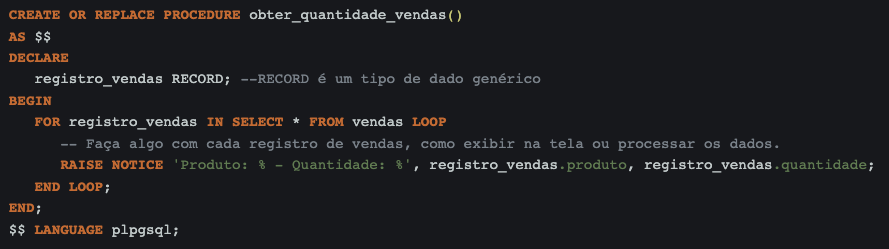

# Banco de Dados II - Desafio 2 Code Park 1

## INSTRUÇÕES DO PROJETO

Uma empresa de vendas tem um banco de dados com informações sobre os seus produtos. Ela precisa criar um relatório que faça um levantamento diário da quantidade de produtos comprados por dia. Para ajudar a empresa, crie um procedure para agilizar esse processo.

Trabalhe esse código em seu IDE, suba ele para sua conta no GitHub e compartilhe o link desse projeto no campo ao lado para que outros desenvolvedores possam analisá-lo.

## Resolução

###Imagem de um banco de dados real
Observação: aparentemente o PostgreSQL não permite uma procedure "SELECT quantidade FROM vendas" pois não há referência
de destino. Portanto é necessário criar(declarar) uma variável e definir um loop.

